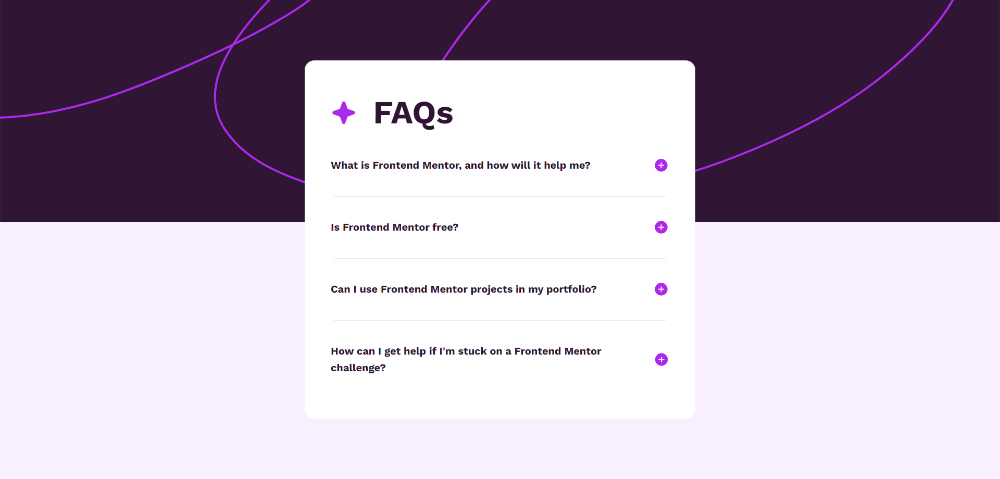
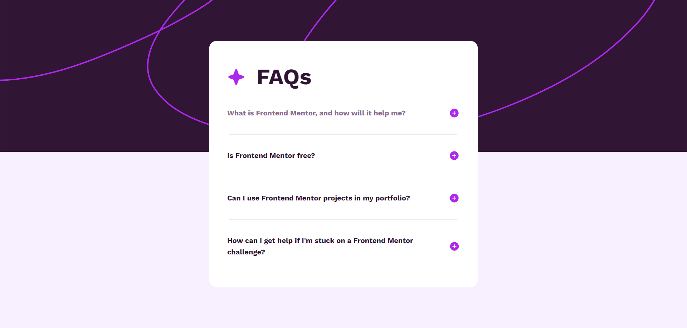
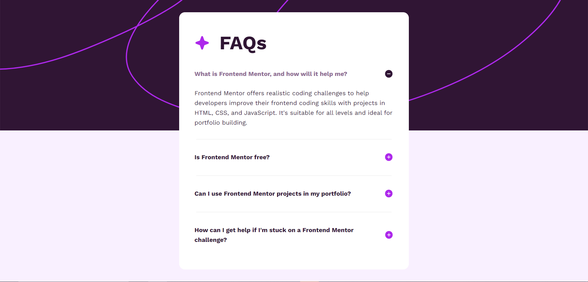
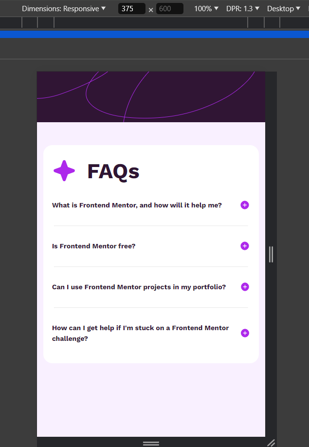

# Frontend Mentor - FAQ accordion solution

This is my solution to the [FAQ accordion challenge on Frontend Mentor](https://www.frontendmentor.io/challenges/faq-accordion-wyfFdeBwBz). Frontend Mentor challenges help you improve your coding skills by building realistic projects.

## Table of contents

- [Overview](#overview)
  - [The challenge](#the-challenge)
  - [Screenshot](#screenshot)
  - [Links](#links)
- [My process](#my-process)
  - [Built with](#built-with)

## Overview

This is a good challenge to practice javascript class manipulation.

### The challenge

Users should be able to:

- Hide/Show the answer to a question when the question is clicked
- Navigate the questions and hide/show answers using keyboard navigation alone
- View the optimal layout for the interface depending on their device's screen size
- See hover and focus states for all interactive elements on the page

### Screenshot

### Links

- Solution URL: [GitHub URL](https://github.com/huz3y/faq-accordion-main.git)
- Live Site URL: [live site URL](https://faq-accordion-main-bay.vercel.app)

## My process

### Built with

- Semantic HTML5 markup
- CSS custom properties
- Sass (SCSS)
- Flexbox
- CSS Grid
- Desktop-first workflow
